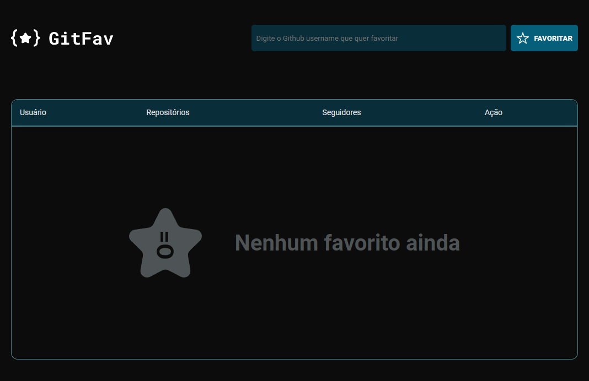
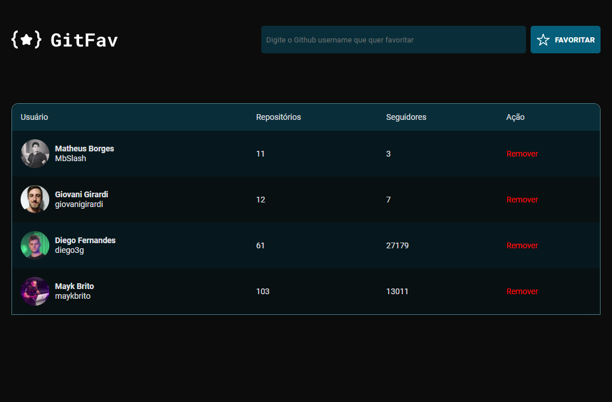

# GitFav - Aplicação para favoritar usuários do GitHub (Introdução ao conceito de API)

> Projeto construído como desafio ao aluno durante as aulas da trilha Explorer da Rocketseat.

    O desafio era criar todo o HTML, CSS e JavaScript da aplicação a partir de um modelo do FIGMA, utilizando DOM e ES Modules (EcmaScript 6 - ES6) com foco nos conceitos: 
    
    👉 API (Application Programming Interface);
    👉 SPA (Single Page Application);
    👉 Orientação a objetos;
    👉 Classes e heranças no JavaScript;
    👉 JSON;
    👉 JavaScript assíncrono;
    👉 Promisses com async/await;
    👉 Princípio da imutabilidade;
    👉 Try, catch, throw.
    
    Reforçamos conhecimentos sobre HTML, CSS, JavaScript, DOM, node, eventos, refatoração de código, clean code, acessibilidade e separação do JS em módulos.

🔗 [Clique aqui para acessar](https://mbslash.github.io/GitFav---Aplicacao-para-favoritar-usuarios-do-GitHub/)

## 💻 Tecnologias

- HTML
- CSS
- JavaScript
- ECMAScript 6
- DOM
- Git e Github
- Figma

## 📧 Contato

matheusb.dev@gmail.com